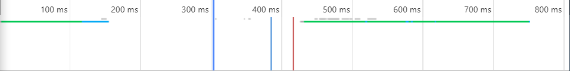

# Task1
我使用的是chrome浏览器F12功能
## 分析[SJTU的首页](https://www.sjtu.edu.cn/)
上海交通大学的首页包含了很多图片和js脚本，因此加载的时间比较长。
### 以下是清空浏览器缓存和cookie后，首次加载SJTU的首页的一些信息
#### 时序图

#### 图片Request

#### Script Request

#### Css Request

从时序图可以看出，整个页面加载过程中，蓝色部分（content download）的占的比重比较大；而从所截部分的request信息可以看出，绝大部分的数据都要download，所花费的时间比较久。

---------

### 以下是若干次访问后，再次访问加载SJTU的首页的一些信息
#### 时序图

#### 图片Request

#### Script Request

#### Css Request

#### 304 Request

在多次访问SJTU首页之后再访问SJTU首页，与初次访问首页有明显的不同，不同之处列举如下：
- 从前后两个时序图可以看出，后一次加载网页的时间比前一次慢（两次加载网页在相似的网络环境下进行）
- 从前后两个时序图可以看出，加载网页过程中的蓝色部分（content download）明显减少，只有少量绿色部分（waiting）
- 在首次访问时候，所有request的status都是200（OK）；而在多次访问后再访问，有一部分request的status变为304（Not Modified）
- 相较于首次访问，多次访问之后的访问，图片requset的响应时间大多变为0ms
### 两者比较的总结
经由SJTU首页的自我比较，可以看出本地缓存对提升网页加载速度有很大的帮助。但是即便是有了缓存提速，SJTU首页的加载速度仍不太理想，因此还要拿SJTU首页和其他website的主页做横向比较来找出原因。

---------

## 其他网页的时序图
#### 百度

#### 必应

#### 知乎

###分析
这几个网页的加载速度都在1000ms左右，远小于SJTU首页的加载速度。分析这些网页的加载信息，我发现：
- 这些网页的request普遍比sjtu的首页少，而且没有很多图片的请求。
- 这些网页的页面，在我基本认为显示完全之后，仍然在进行很多request。
- 随着用户下拉页面，页面会继续动态加载很多新的内容。

---------

## 结论
经过对SJTU首页的横向和纵向比较，我得到以下加快加载的方案：
- 将一些不常更新的文件留作本地缓存
- 优先检查本地缓存是否需要修改，而不是直接下载数据
- 尽量减少request的数量
- 尽量减小所需数据的大小
- 在不影响用户使用的前提下，分多次加载网页内容
