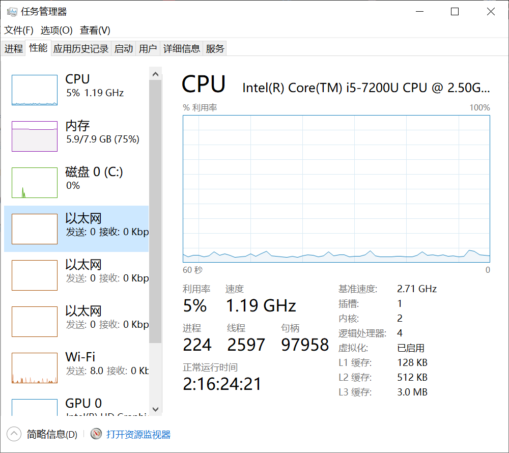
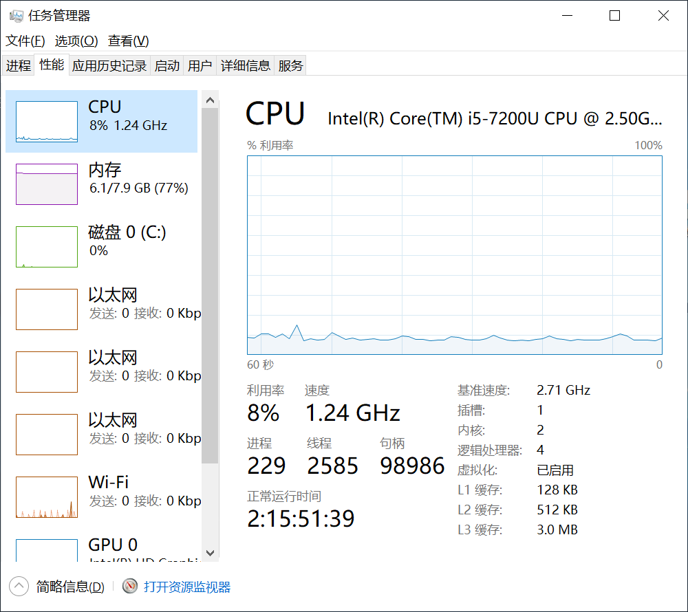
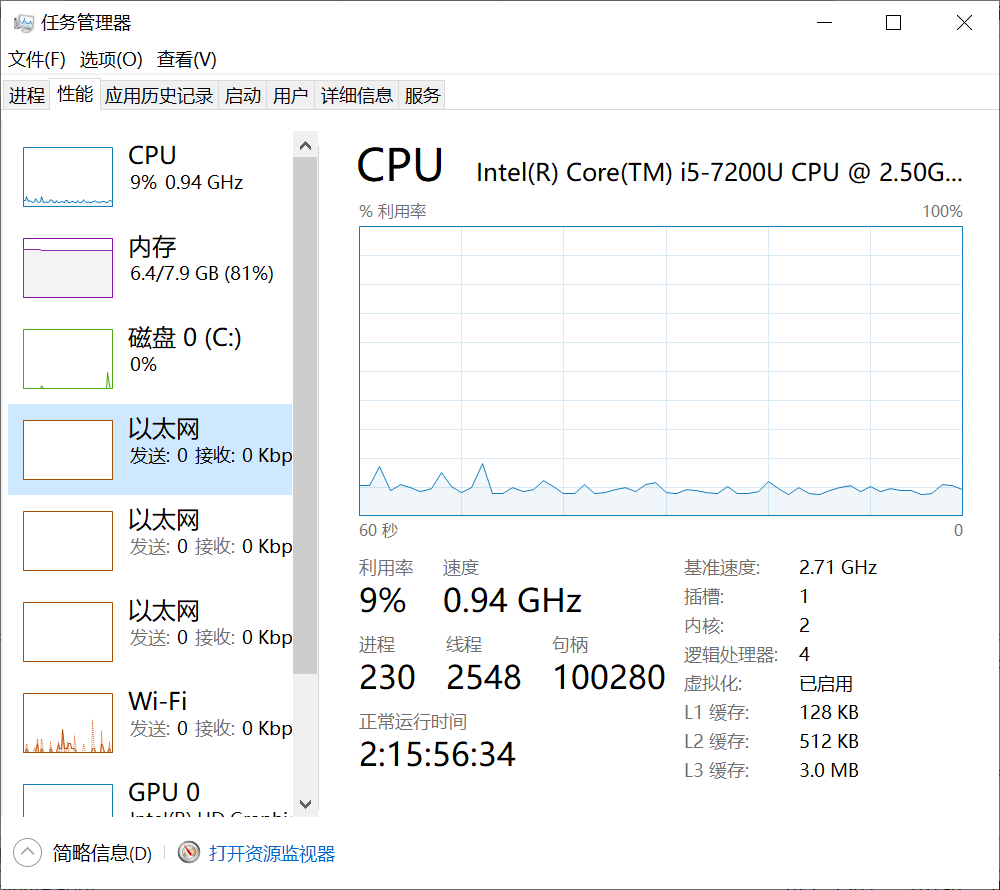
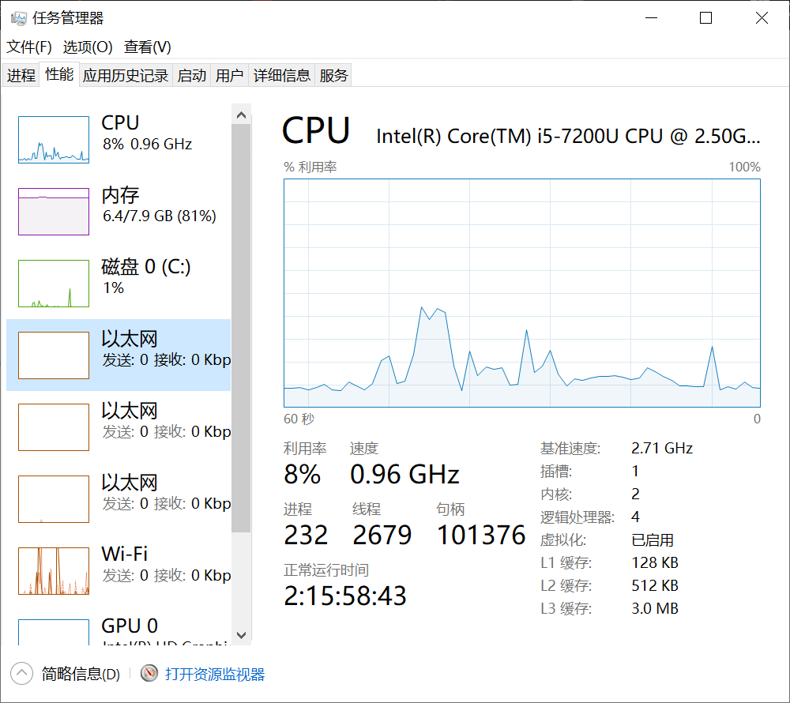
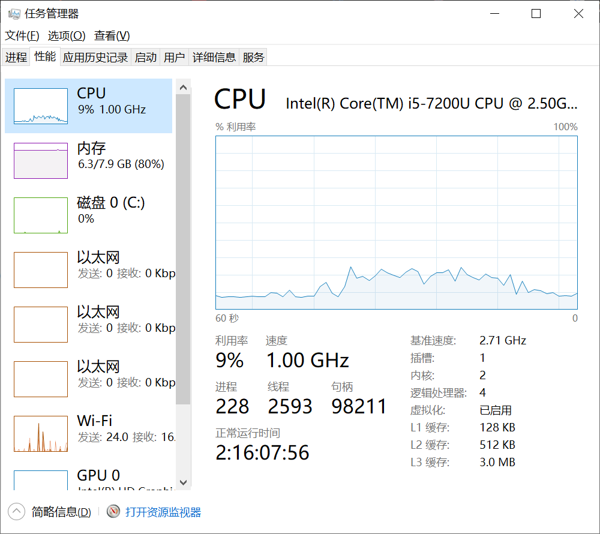

# Task 2
我使用windows10的任务管理器，**性能**标签栏，来获取CPU和内存的使用情况。
## 以下是在各种情况下，CPU和内存消耗情况的截图
### 系统刚启动并达到平稳运行以后

### 启动intellij并达到平稳运行以后

### 启动spring并达到平稳运行以后

### 正常使用一遍spring项目的功能以后

### 在前端不停发送post请求以后

## 结论
### CPU消耗
分析上面五张图，可以看出，不管是运行intellij或是运行spring，只要达到平稳运行以后，CPU的消耗都是8%-9%。
而在正常使用以及不断发送post的时候，看以看出CPU的消耗有明显的波动。可以认为CPU消耗增加的那些时间段，都是计算机在处理请求的时间段。
### 内存消耗
分析上面五张图，可以看出，运行intellij大概消耗了0.2G的内存，运行spring项目大概消耗了0.3G的内存。
而在正常使用以及不断发送post的时候，在CPU消耗波动的时候，内存消耗并没有明显增加。可以认为spring项目对于内存的使用并不大。
